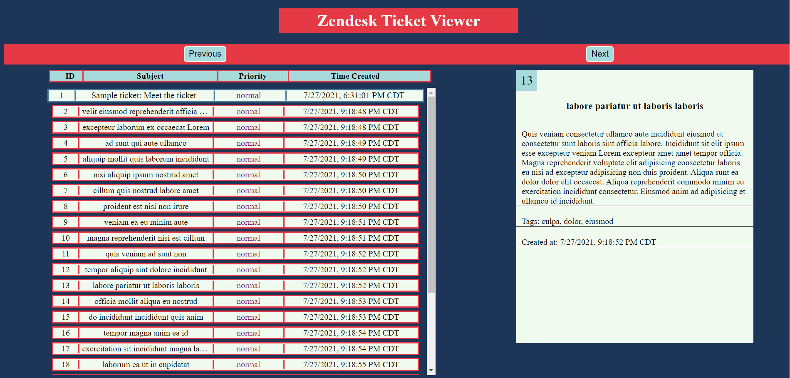

# Zendesk Coding Challenge

## _Installation and Set Up:_

- First, Node.js and git must be installed in your environment. Please refer to the [official Node.js website](https://nodejs.org/) and [official git website](https://git-scm.com/downloads)
  for instructions about how to install them on different operating systems.
- Then, you will be able to clone my repository, navigate into the project folder, and install all dependencies with the following commands.

```
git clone https://github.com/jack-rabe/zendesk-coding-challenge.git

cd zendesk-coding-challenge

npm install
```
- Finally, I attached a .env file in an email to Sabrina Ginter. After you paste this file into the root directory of the project, it will be fully functional and ready to go.


## _Usage:_

### Running the Application

```
npm run start
```

- After running this command, navigate to [http://localhost:3000](http://localhost:3000/) to open the application.
- You will then be able to page through 25 tickets at a time by clicking the previous and next buttons.
- To view more details of any ticket, click on the ticket, and the ticket will appear in the individual ticket viewer on the right side of your screen.

### Testing

```
npm run test
```

- After running this command, you will receive feedback from jest on your command line about which tests are passing and failing.
- To receive more detailed feedback about how much of the code is being covered by the tests, run the following command instead.

```
npm run testCoverage
```
## _Notes:_
- The expression-session module uses MemoryStore, which is prone to memory leaks and should only be used in development.
- In hindsight, I would fetch the data in smaller chunks to reduce the inital load time of my webpage.
- I am color blind, so don't blame me if I picked an ugly color scheme :)
## _Preview:_


